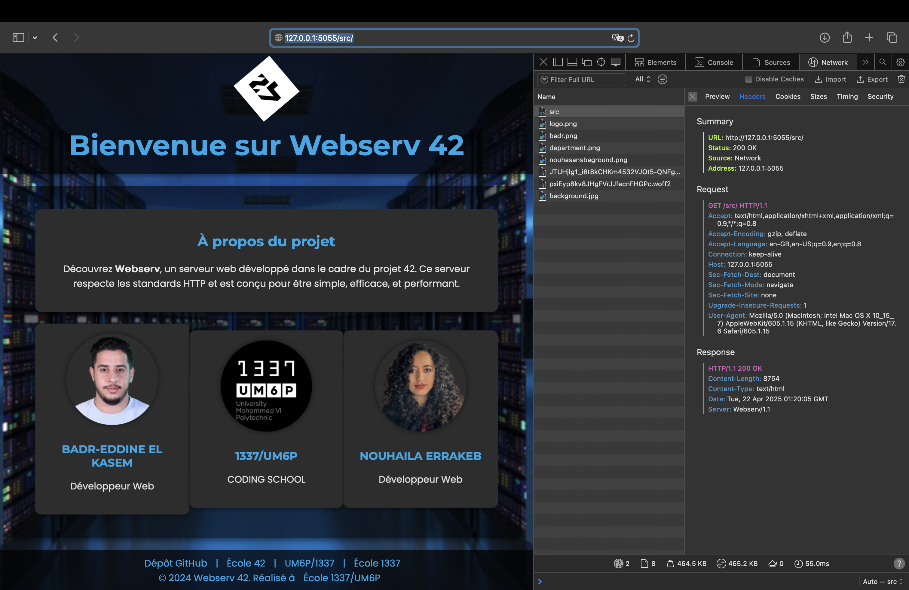
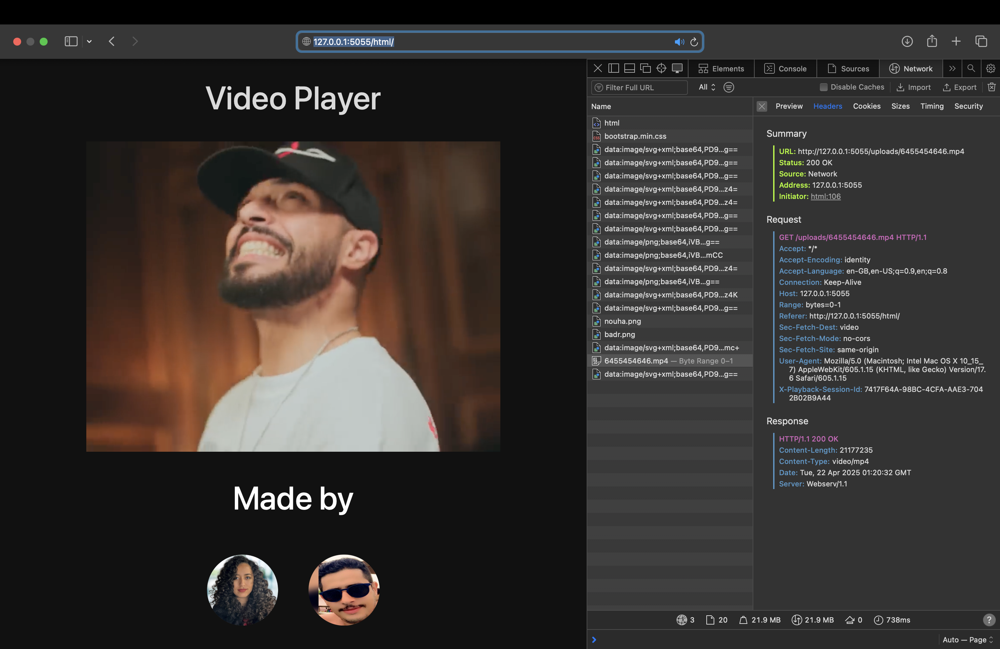
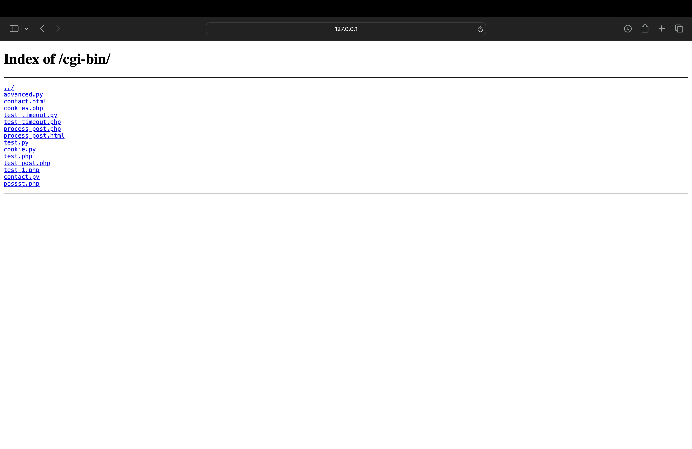
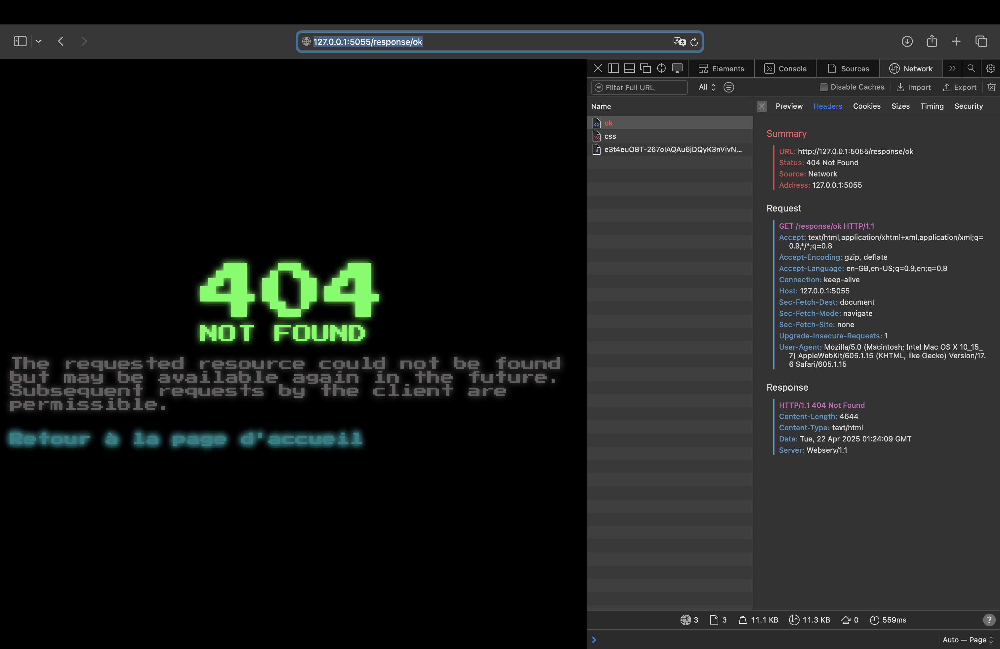
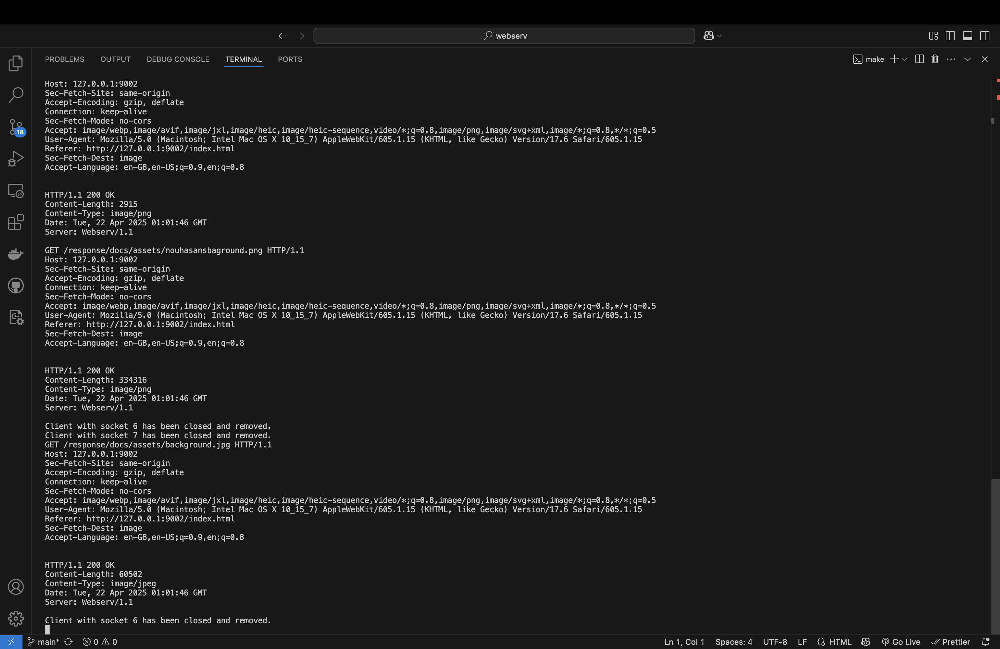

# 🌐 Webserv

A lightweight HTTP server built from scratch in C++. This project was developed to deepen our understanding of networking, the HTTP protocol, and server architecture.

## 🚀 Features

- 📡 Handles HTTP/1.1 requests  
- 🗂️ Serves static files and directories  
- 🧠 Custom configuration parsing  
- 🗑️ Supports file and directory deletion (DELETE method)  
- ⚙️ CGI support for Python and PHP scripts  
- 🧪 Stress-tested with Siege  
- 🕵️ Memory-leak safe (checked with Valgrind)  
- 🚫 Detects and avoids hanging connections  

## 📄 Supported HTTP Methods

- `GET` – Retrieve files or directory listings  
- `POST` – Accept data sent to the server  
- `DELETE` – Remove files or directories  

## ⚙️ Configuration

The server behavior is customizable via a configuration file:

```bash
./webserv config/default.conf
```
This file defines things like:
- Server blocks (IP, port)
- Location blocks (root, methods, error pages)
- Index files
- CGI support for specific paths and extensions

### 🛠️ Building

To build the server:
```bash
make
```
To clean build files:
```bash
make fclean
```
To rebuild from scratch:
```bash
make re
```
## 🧪 Testing

You can test the server with tools like:

- Browser – Navigate to http://localhost:<port>/src

- curl – Example: curl -X GET http://localhost:<port>/index.html

- siege – For stress testing: siege http://localhost:<port>

Make sure the port you use is open and not already taken.

## 🖼️ Screenshots

Below are screenshots of the different pages handled by the server:

### Index Page


### Display Page


### Cgi Directory Page


### Error Page


### CGI Execution Page


### Terminal Outputs Page
