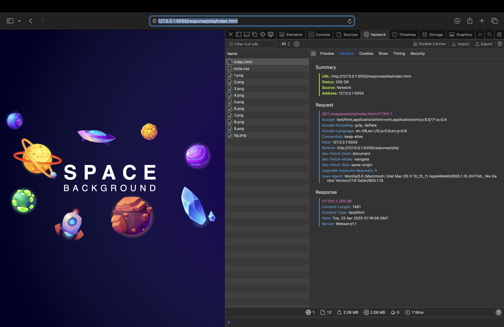
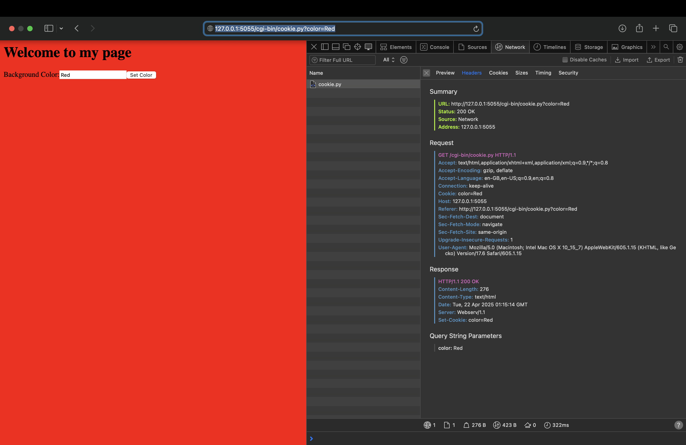
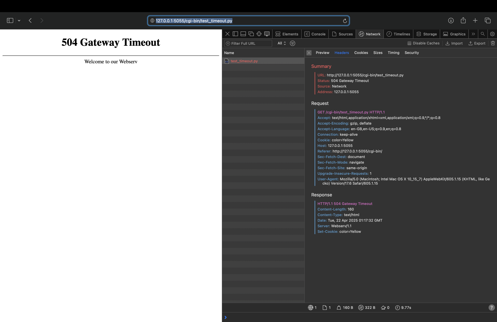

# 🌐 Webserv

Webserv is a lightweight yet fully functional HTTP/1.1 server implemented from scratch in C++. Designed to deepen understanding of networking and server architecture, this project serves static files, handles dynamic requests with CGI (Python and PHP), and supports essential HTTP methods such as GET, POST, and DELETE.
In addition to its core features, Webserv is capable of serving video files like .mp4 and .webm, making it versatile for various types of content. The server's behavior can be finely tuned through a customizable configuration file that supports location blocks, error handling, and CGI settings.
Extensive testing was carried out using Postman for HTTP requests and Siege for stress testing. To ensure reliability, the server has been memory-leak tested with Valgrind, and it intelligently avoids hanging connections.

## 🚀 Features

- 📡 Handles HTTP/1.1 requests  
- 🗂️ Serves static files and directories
- 📺 Can serve video files like .mp4, .webm, etc.
- 🧠 Custom configuration parsing  
- 🗑️ Supports file and directory deletion (DELETE method)  
- ⚙️ CGI support for Python and PHP scripts  
- 🧪 Stress-tested with Siege  
- 🕵️ Memory-leak safe (checked with Valgrind)  
- 🚫 Detects and avoids hanging connections  

## 📄 Supported HTTP Methods

- `GET` – Retrieve files or directory listings  
- `POST` – Accept data sent to the server  
- `DELETE` – Remove files or directories  

## ⚙️ Configuration

The server behavior is customizable via a configuration file:

```bash
./webserv config/default.conf
```
Make sure to update the configuration file to match your system's file paths, ports, and CGI interpreter locations.
This file defines things like:
- Server blocks (IP, port)
- Location blocks (root, methods, error pages)
- Index files
- CGI support for specific paths and extensions

### 🛠️ Building

To build the server:
```bash
make
```
To clean build files:
```bash
make fclean
```
To rebuild from scratch:
```bash
make re
```
## 🧪 Testing

During development, we relied on tools like **Postman** to test various HTTP requests and ensure consistent server behavior. It helped us validate headers, payloads, response codes, and more.

You can test the server with tools like:

- Browser – Navigate to http://ipaddr<ipaddr>:port<port>/src

- curl – Example: curl -X GET http://ipaddr<ipaddr>:port<port>/index.html

- siege – For stress testing: siege http://ipaddr<ipaddr>:port<port>

Make sure the port you use is open and not already taken.

## 🖼️ Screenshots

Below are screenshots of the different pages handled by the server:

### Index Page


### Display Page


### Cgi Directory Page


### Error Page


### Html/JS/CSS Page


### CGI Execution Page with cookie


### CGI Timeout Error


### Terminal Outputs Page


## 👨‍💻 Authors

This project was a team collaboration as part of our systems programming curriculum. Built with 💙 and C++.

- **[@Nouhaila](https://github.com/nouhaerr)** – Configuration parsing, Errors handling, POST/GET methods, Response handling, File I/O, and Testing.
- **[@Badr](https://github.com/SAINT-CLAIRE-MERODE)** – Multiplexing, CGI integration, Request parsing, and DELETE method.

## 📜 License

This project is for educational purposes and not intended for production use. License info can be added here if applicable.